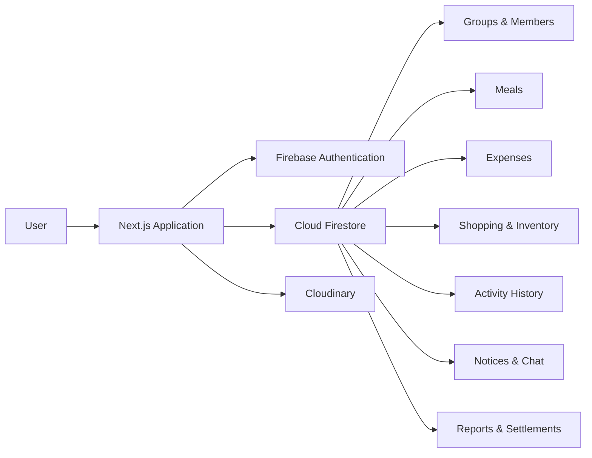

# BachelorBite 🐊

**A shared-living management platform built around the everyday reality of bachelor life in Bangladesh.**

Meals, bazar, shared expenses, shopping, inventory, reports, and monthly settlements — connected in one place.

<p align="center">
  <a href="https://youtu.be/wkS-siiW1XI">
    
  </a>
</p>

<p align="center">
  <strong>▶ Watch the BachelorBite Demo</strong>
</p>

<p align="center">
  <a href="YOUR_LIVE_WEBSITE_URL"><strong>🌐 Live Demo</strong></a>
  &nbsp;•&nbsp;
  <a href="https://youtu.be/wkS-siiW1XI"><strong>▶ Video Demo</strong></a>
</p>

---

## Why BachelorBite?

Living in a **mess or shared flat in Bangladesh** usually comes with one recurring problem: **হিসাব**.

Meal counts may be written in a notebook, bazar expenses kept in someone's personal notes, utility bills discussed in chat, and the final calculation moved into Excel at the end of the month.

Then someone forgets an entry. Someone remembers a number differently. Old records become hard to find. Members keep asking whether a meal was counted, who bought what, who paid a bill, or how much they still owe.

**BachelorBite brings those scattered routines into one shared system.**

Less notebook chasing.  
Less repeated calculation.  
Less back-and-forth about the হিসাব.

---

## The Full Flow

**English**

`Log Meals → Plan Shopping → Claim → Buy → Record Expenses → Track Inventory & Activity → Calculate Monthly Balance → Settle`

**বাংলা**

`মিল লিখুন → বাজারের তালিকা করুন → দায়িত্ব নিন → কিনুন → খরচ লিখুন → ইনভেন্টরি ও অ্যাক্টিভিটি দেখুন → মাসিক হিসাব করুন → সেটেল করুন`

---

## Key Features

| Feature | What it does |
|---|---|
| 🍽️ **Meal Tracking** | Log daily meals by date, meal type, and count. |
| 💳 **Shared Expenses** | Record groceries, electricity, gas, and other shared costs. |
| 🛒 **Smart Shopping List** | Add needed items, set priority, claim what you will bring, and track full or partial purchases. |
| 📦 **Shared Inventory** | Turn grocery purchase records into a monthly view of what the group bought, how much, and at what cost. |
| 🧾 **Receipts & Purchase Details** | Keep supported expense records connected with purchase details and receipt images. |
| 🕓 **Activity Log** | See important meal, expense, undo, and admin activity in one transparent history. |
| 📊 **Monthly Report** | Calculate food cost, total meals, meal rate, utilities, other expenses, and member-wise balances. |
| ⚖️ **Settlement** | See who **Gets** and who **Owes**, then record completed settlements and keep the history. |
| 📌 **Notice Board** | Keep important group updates separate from everyday conversation. |
| 💬 **Group Chat** | Share quick messages and photos inside the group. |
| 🛡️ **Admin Controls** | Manage members, meal types, selected permissions, corrections, and group data. |

> **Note:** BachelorBite records settlements; it does not transfer money.

---

## What Makes BachelorBite Different?

BachelorBite is **not designed as only an expense tracker**.

Its main idea is to connect the complete shared-living workflow:

**meals → shopping → purchases → expenses → inventory → activity history → monthly calculation → settlement**

Instead of maintaining the same information across notebooks, chats, personal notes, and spreadsheets, the group gets one connected record.

Mistakes also do not have to disappear silently. Supported undo and correction actions can remain visible in the activity history, helping the group understand what actually happened.

> **Less হিসাব. Less headache. More living.**

---

## A Few Product Decisions I Care About

### Transparent changes
Important undo and correction actions leave a visible trail instead of quietly rewriting history.

### Connected shopping
The shopping list is not isolated from expenses. Claimed items can move into the purchase flow, and grocery purchase details contribute to the group's records.

### Group-first design
Meals, expenses, notices, shopping, reports, and settlements are organized around a shared group rather than isolated personal records.

### Fair monthly results
Daily activity feeds into monthly summaries and member balances, making the final settlement easier to understand.

---

## Tech Stack

**Frontend**
- Next.js 15
- React
- TypeScript
- Tailwind CSS
- shadcn/ui / Radix UI
- Lucide React
- Framer Motion
- GSAP

**Backend & Data**
- Firebase Authentication
- Cloud Firestore
- Firebase hosting/configuration

**Media**
- Cloudinary

**Other**
- React Hook Form
- Zod
- Recharts
- date-fns

---

## Architecture



---

## Project Structure

<details>
<summary><strong>View project structure</strong></summary>

```text
src/
├── app/              # Application routes and pages
├── components/       # Product and UI components
├── contexts/         # Shared application contexts
├── firebase/         # Firebase configuration and Firestore hooks
├── hooks/            # Reusable React hooks
├── i18n/             # Localization resources
└── lib/              # Types, utilities, and shared logic

public/               # Static assets
firestore.rules       # Firestore security rules
firebase.json         # Firebase configuration
```

</details>

---

## Run Locally

### Prerequisites

- Node.js `20.9+`
- npm
- A Firebase project
- Cloudinary credentials for supported media uploads

### 1. Clone the repository

```bash
git clone https://github.com/lotuslazim/bachelorbite.git
cd bachelorbite
```

### 2. Install dependencies

```bash
npm install
```

### 3. Configure environment variables

Create a `.env.local` file in the project root:

```env
NEXT_PUBLIC_FIREBASE_API_KEY=
NEXT_PUBLIC_FIREBASE_AUTH_DOMAIN=
NEXT_PUBLIC_FIREBASE_PROJECT_ID=
NEXT_PUBLIC_FIREBASE_STORAGE_BUCKET=
NEXT_PUBLIC_FIREBASE_MESSAGING_SENDER_ID=
NEXT_PUBLIC_FIREBASE_APP_ID=
NEXT_PUBLIC_FIREBASE_MEASUREMENT_ID=

NEXT_PUBLIC_CLOUDINARY_CLOUD_NAME=
NEXT_PUBLIC_CLOUDINARY_UPLOAD_PRESET=
```

### 4. Start development

```bash
npm run dev
```

Then open the local URL printed by Next.js.

---

## Demo

🎥 **Video walkthrough:**  
https://youtu.be/wkS-siiW1XI

🌐 **Live website:**  
https://bachelorbite.vercel.app

---

## Built By

**Lotus Lazim**

Built from a simple question:

> **Why should managing a shared home require so many separate notes, calculations, and conversations?**

---

If you find the idea useful, feel free to explore the project, try the demo, or share feedback.
